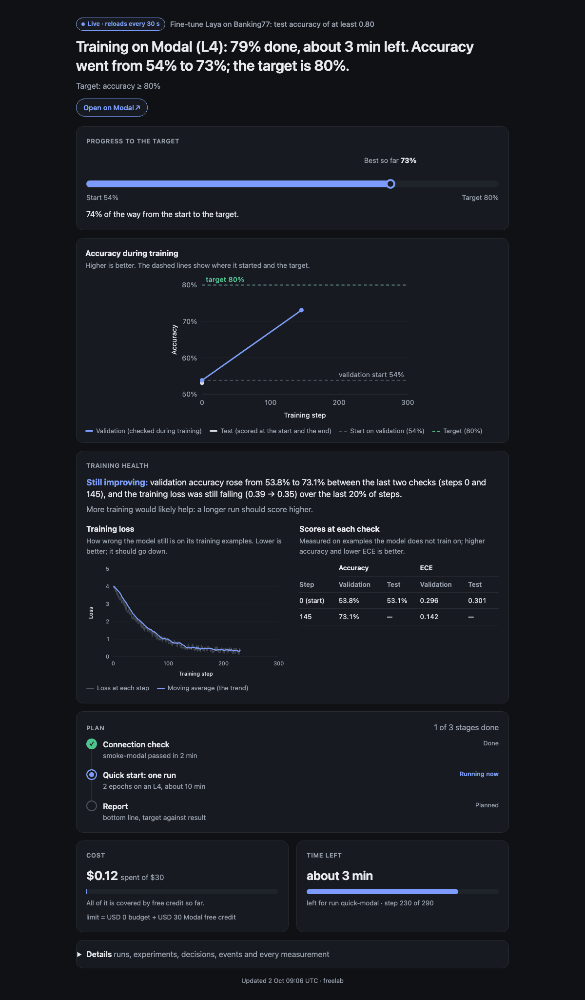

# freelab

**Run ML experiments on free GPUs, from Claude Code.**

[](https://github.com/avshalomd/freelab/actions/workflows/ci.yml)

freelab is a Claude Code plugin. Give your agent an experiment (fine-tune a model, run an evaluation, try to beat a
baseline) and it plans it with you, runs it on the free tiers of Modal, Kaggle and Lightning AI or on your own
machine, shows it on a live status page, and tells you plainly whether it worked.



## Install

In Claude Code 2.1.284 or later (the version CI checks), in the terminal or in the desktop app's chat box, type
these two lines:

```
/plugin marketplace add avshalomd/freelab
/plugin install freelab@freelab
```

The first session offers a short setup once; you can also say "set up freelab" any time. Setup asks how much of
this computer to use, which free services to connect, and walks you through each sign-up. The agent can drive
the browser for you; you type passwords and paste keys yourself.

**Needs:** macOS or Linux (Windows untested), python3 3.10+, [uv](https://docs.astral.sh/uv/), and git for the
research loop.

## What you get

- **An experiment you understand.** Before anything runs, the agent recommends a setup (data and splits,
  baseline, metric and target, where it runs, what it costs) and explains each choice and its alternatives.
  "Go with recommended" approves it, or change any part.
- **Free compute first.** Runs go to free cloud credit, or to your machine within a day/night allowance you
  pick. A run moves between services when a quota runs out. Nothing beyond free credit is spent without your yes.
- **A live status page.** One self-contained HTML page: what is happening in one sentence, progress to the
  target, charts, a training-health verdict (is more training still helping?), the plan and the cost.
- **An honest report.** Results with confidence intervals and the baseline beside them, then concrete next
  steps: try the model locally, train longer, try to beat it, or clean up.
- **A research loop.** "Try to beat it" runs an [autoresearch](https://github.com/karpathy/autoresearch)-style
  loop: one change per experiment, kept or reset in git on a validation split, the test split scored once at the
  end. It works in its own git worktree, so your files are never touched.
- **Stays in its lane.** An experiment is often a small part of a bigger project. freelab keeps its files in
  `lab/` and experiment code in `experiments/<name>/`, and after the report it hands back to what you were doing.

## Quick start

Say **"run the quick start"**. It fine-tunes [Laya](https://huggingface.co/convaiinnovations/laya), an open
421M-parameter model, on [Banking77](https://huggingface.co/datasets/mteb/banking77) (77 bank-support intents):
one run of about 10-17 minutes on a free GPU, target test accuracy 0.80, at most about USD 0.30 of free credit
(free on Kaggle). Afterwards "try to beat it" runs a short research loop, about 10-17 minutes on Modal's L4.

| Where | Before training | After (3,076 test items, 95 % interval) |
|---|---|---|
| Kaggle (T4) | 0.544 | 0.828 (0.814–0.841) |
| Modal (L4) | 0.544 | 0.822 (0.808–0.835) |
| Apple M4 Pro, 1 epoch | 0.544 | 0.767 (0.752–0.782) |

One run per backend, one seed.

Details, measured times and costs: [examples/banking77-laya](examples/banking77-laya/README.md).

## Free GPU time

Checked 28 September–2 October 2026; plans change, so check each provider's page before a long run.

| Service | Free GPU time | Needs |
|---|---|---|
| [Kaggle](https://www.kaggle.com/docs/efficient-gpu-usage) | About 30 T4 hours a week | Phone verification |
| [Modal](https://modal.com/pricing) | USD 30 of credit a month, about 33 T4 hours | A card (set a usage limit) |
| [Lightning AI](https://lightning.ai/pricing) | Up to 30 credits, likely once: about 30 T4 hours | Phone; a card for 25 of the credits |

## Safety

- **Keys:** each key goes in your project's `.env`, which you fill in yourself; the agent adds empty
  placeholders, keeps `.env` in `.gitignore`, and never reads it. It loads `.env` into one command at a time.
- **Money:** every launch has a logged cost estimate and a time cap first; spending beyond free credit or the
  agreed budget needs your approval.
- **Hooks** back this up, only for freelab's own work: they block reading the project's `.env` and the
  services' key files, block a freelab training launch that has no budget or estimate, ask before deleting
  freelab's cloud data, and remind the agent to write the report when a run ends. They only check `.env` for
  freelab's marker line and never print a line of it. They run on every tool call and exit at once in a project
  that does not use freelab. Your own commands, cloud jobs and git are left alone. The hooks are an accident
  guard, not a sandbox, and a session started in a folder above the project is not guarded.

## How it works

Eight skills, mostly guidelines the agent follows with each service's own CLI, plus a few small scripts
(standard-library Python) for the parts prose cannot do reliably: the run contract, polling, the status page,
the ledger, cleanup and the hooks.

| Skill | Does |
|---|---|
| `lab` | Entry point and operating rules |
| `onboard` | Machine allowance, sign-up, keys and a connection check per service |
| `plan` | The explained charter and the plan |
| `compute` | Placement, launch, watching, moving runs, recovery |
| `research` | The research loop |
| `status` | The live status page |
| `report` | Report, next steps, handoff |
| `cleanup` | Frees space, always keeps every metric |

Experiments follow a small run contract (`--out`, `--resume`, `--max-minutes`, `--smoke`; `metrics.jsonl`,
atomic checkpoints), so the same `train.py` runs on every backend and a preempted run resumes.

## Status

0.4.1. Verified live: full quick-start runs on Kaggle, Modal and an Apple M4 Pro (the results above), and on
Lightning AI for timing and cost (its accuracy was not recorded). Covered by unit tests but not yet run live: the
poll, hooks, cleanup script and research-loop worktree added in 0.4.0. Commands not yet
exercised live are marked "to verify live" in
[`skills/compute/references/`](skills/compute/references/). Changes are in [CHANGELOG.md](CHANGELOG.md).

## Development

```bash
uv run --with pytest pytest -q
```

```bash
claude plugin validate . --strict
claude plugin validate .claude-plugin/plugin.json --strict
```

Behaviour evals live in [`evals/`](evals/) (`claude plugin eval . --scaffold --allow-tools Bash Write Edit`). To
try a local checkout, add it as a marketplace: `/plugin marketplace add /path/to/freelab`.

## Credits

[Laya](https://github.com/NandhaKishorM/laya) by Convai Innovations (Apache-2.0; `laya_head.py` is adapted from
it), [Banking77](https://huggingface.co/datasets/mteb/banking77) by PolyAI (CC-BY-4.0), and the free tiers of
[Modal](https://modal.com), [Lightning AI](https://lightning.ai) and [Kaggle](https://www.kaggle.com) (freelab is
not affiliated with them). The research loop follows Andrej Karpathy's
[autoresearch](https://github.com/karpathy/autoresearch); freelab ships none of its code.

## Licence

MIT, see [LICENSE](LICENSE). `examples/banking77-laya/laya_head.py` is Apache-2.0 (adapted from Laya), see
[examples/banking77-laya/LICENSE-APACHE-2.0](examples/banking77-laya/LICENSE-APACHE-2.0).
